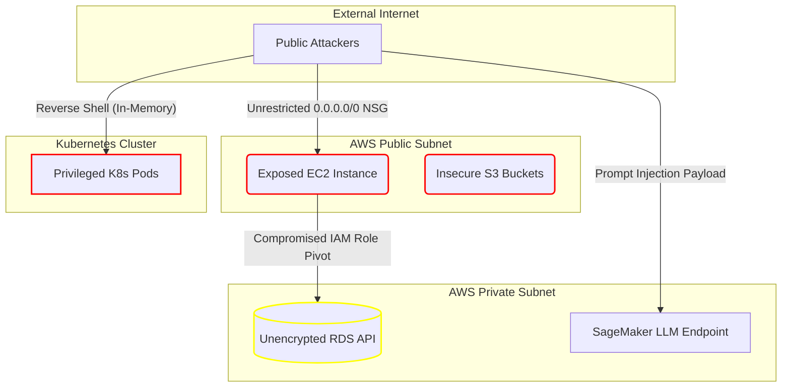

<p align="center">
  
  
  
  
</p>

# 🐯 TigerGate Platform Simulator
Welcome to the absolute **World-Class** TigerGate CNAPP Test Suite! 🚀  
This repository is an exhaustively engineered, highly-structured collection of modern applications, scripts, and Infrastructure-as-Code (IaC) templates deliberately infused with severe, elite-level security vulnerabilities.

Its purpose is to serve as the ultimate evaluation engine for testing **TigerGate's** holistic Cloud Native Application Protection Platform (CNAPP), proving its efficacy across all 10 major security pillars natively.

---

## 📑 Table of Contents
1. [Core Features & Pillar Coverage](#-core-features--pillar-coverage)
2. [Advanced Techniques Repository](#-advanced-techniques-repository)
3. [System Architecture](#-system-architecture)
4. [Getting Started (Freshers & Admins)](#-getting-started)
5. [Process Flow](#-process-flow)

---

## 🎯 Core Features & Pillar Coverage
The repository is categorized strictly into distinct security modules that TigerGate dynamically intercepts:

* 🌩️ **CSPM**: Cloud Security Posture elements (`cspm/`) hitting AWS, Azure, GCP, and Oracle missing essential encryptions.
* 🔐 **CIEM & DSPM**: Overly broad cross-account trust vectors (`ciem/`) and unencrypted Multi-AZ RDS deployments containing `PII` data classes (`dspm/`).
* 📦 **KSPM & CWPP**: Kubernetes YAML structures running privileged root-pods alongside compromised host shell setups (`kspm/`, `cwpp/`).
* 🤖 **AI-SPM**: Embedded HuggingFace deployment misconfigurations and dangerous LLM Prompt Injection surfaces (`ai_spm/`).
* 🔗 **API & Code Security**: Flawed Swagger, DoS GraphQL configurations, SOAP XXE faults, and SaaS structures across Node, Python, Ruby, PHP, and Java.
* 🎫 **Secrets & Governance**: Extreme raw dumps of Stripe, Slack, and AWS keys, complemented by fundamentally broken `.github/CODEOWNERS` policies.

---

## 🧨 Advanced Techniques Repository
To truly pressure-test the TigerGate engine, we deployed advanced state-of-the-art cyber attack mechanics:
* **Attack Paths / Lateral Movement (`attack_paths/`)**: A complex multi-hop Terraform matrix validating TigerGate's Attack Path Graph. An exposed EC2 server is bound to a flawed IAM role allowing direct privilege esc to an internal private RDS.
* **Fileless Runtime Evasions (`advanced_evasion/`)**: eBPF-targeted scripts generating base64 obfuscated reverse shells loaded directly into `/dev/shm` memory to bypass traditional filesystem CWPP trackers.
* **Deep SAST (`sast_advanced/`)**: Highly volatile Server Side Template Injections (SSTI) and JSON Deserialization Remote Code Execution gadgets.

---

## 🏗️ System Architecture



---

## 🚀 Getting Started

If you are a Fresher or DevOps engineer evaluating the system locally prior to loading into TigerGate:

1. **Clone & Explore:**
   Review the directory structures natively mapped to your training paths.
2. **Access the automated Makefile:**
   Run the following terminal commands to execute the environment tests safely.
   ```bash
   make help      # Show all available commands
   make install   # Install baseline NPM/Python environments
   make test      # Lint and execute core syntaxes
   ```

3. **TigerGate Integration:**
   * Commit the repository into your standard Git tracking structure.
   * Access your TigerGate CNAPP Dashboard.
   * Connect tracking pipelines and instantly visualize hundreds of Code, Context, and Cloud failures automatically identified.
