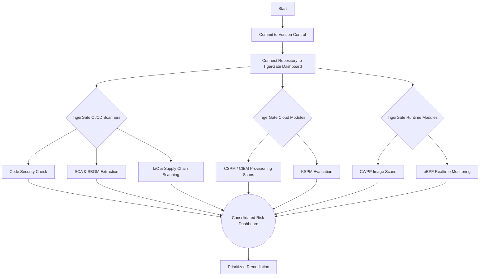

# Process Flow

To properly ingest and measure the value of the TigerGate engine against this repository, follow this operational flowchart:

## Step by Step
1. **Initialize Git**: Commit these files into a pristine branch.
2. **Scanner Integration**: Pair the repository with the TigerGate application.
3. **Observation**: Watch the 900+ cloud checks flag the precise lines in the `.tf` and `.yaml` templates.
4. **Runtime evaluation**: On a monitored node, optionally run `make attack` to verify eBPF captures the simulated anomalies in real-time.
